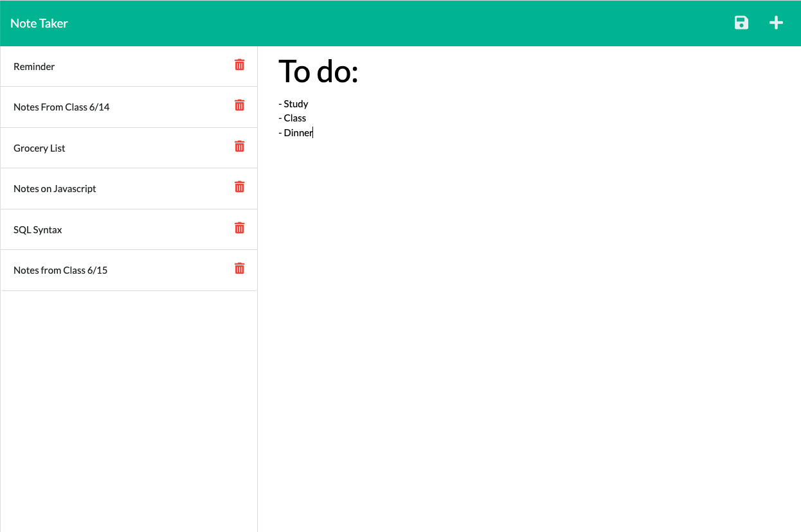

# Note Taker Application

This is a note taking application that will allow the user to create, save, and delete simple, titled notes. It would be useful for taking short notes on a topic of study, or creating short To-do lists. It uses Express.js for routing and saving and loading old notes, and also uses fs and path packages. After you clone the repo to your computer, be sure to run 
```
npm install
```

## Link to Deployed Application:

https://note-taker-jcd.herokuapp.com/ 

## Screenshot of Application:



